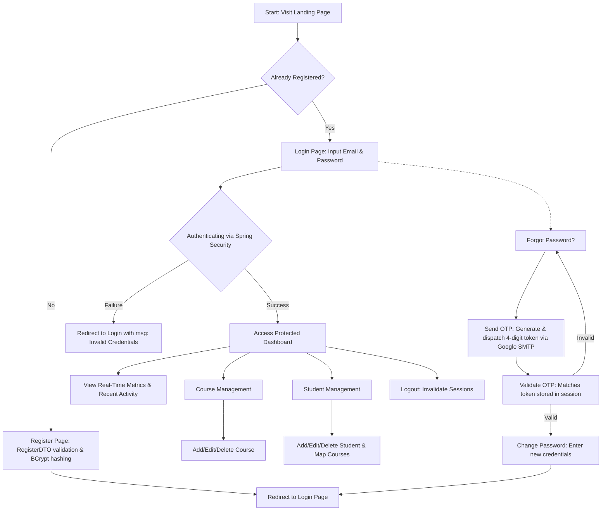

# 🎓 Student Management System (SMS)

A premium, highly secure, and feature-rich **Spring Boot & JPA Web Application** designed for educational institutions to manage courses and student records efficiently. Featuring custom Spring Security authentication, multi-layered relational structures, automated OTP-based password recovery via Google SMTP, and a visually stunning, responsive JSP dashboard with modern gradient aesthetics.

---

## 🚀 Key Features

*   **🔒 Secure authentication:** Custom security configurations utilizing Spring Security with path authorization and BCrypt password encryption.
*   **📊 Dynamic manager dashboard:** Real-time analytics showcasing total course count, total student enrollment, and recent activity logs custom-tailored to the logged-in administrator.
*   **📚 Course management (CRUD):** Easily create, view, edit, and delete courses with automatic referential integrity handling.
*   **🧑‍🎓 Student enrollment (CRUD):** Full management of student details with multi-course enrollment mapping via a many-to-many relationship.
*   **✉️ SMTP-powered OTP password recovery:** Standard integration with JavaMailSender and Gmail SMTP to securely generate, email, and validate 4-digit OTPs to reset forgotten passwords.
*   **🎨 Premium responsive UI:** Elegant custom vanilla CSS designs featuring glassmorphic attributes, vibrant green-to-blue gradients, Remix icons, and professional Google typography (Libre Franklin, Merriweather, Saira).
*   **⚡ Centralized error control:** Robust global exception handling that intercept runtime failures and present clean, user-friendly feedback pages.

---

## 🛠️ Technology Stack

| Layer | Technology / Library | Description |
| :--- | :--- | :--- |
| **Backend Core** | Java 17, Spring Boot 3.2.5 | Enterprise application framework & run-time environments. |
| **Database & JPA** | PostgreSQL, Spring Data JPA, Hibernate | Relational persistence layer, query repositories, and DDL automation. |
| **Security Layer** | Spring Security 6 | Custom filter chains, BCrypt hashing, session and path protection. |
| **Frontend/Views** | Jakarta JSP, JSTL, Apache Tomcat Jasper | Server-side template rendering for dynamic HTML views. |
| **UI Aesthetics** | HTML5,  CSS, Remix Icons | Elegant responsive styling with Google Fonts integrations. |
| **Utilities** | Project Lombok, JavaMailSender | Boilerplate reduction and SMTP email dispatch capabilities. |

---

## 📦 Project Architecture & Package Structure

The system is structured under a clean, scalable architectural pattern:

```text
src/main/java/com/example/__student_management_system/
├── Application.java               # Spring Boot Bootstrap Application Entry Point
├── configurations/
│   └── SecConfig.java            # Spring Security configuration & BCrypt Password Encoder
├── controllers/
│   ├── AuthController.java       # Handles Login, Dashboard, OTP, Password Reset, Registration
│   ├── CourseController.java     # Handles Course CRUD endpoints
│   └── StudentController.java    # Handles Student CRUD endpoints
├── dtos/
│   ├── CourseDTO.java            # Data Transfer Object for Courses
│   ├── RegisterDTO.java          # Data Transfer Object for User Registration
│   └── StudentDTO.java           # Data Transfer Object for Students
├── entities/
│   ├── Course.java               # Course Entity (Id, Name, Duration, Many-to-Many with Student)
│   ├── Student.java              # Student Entity (Id, Name, Email, Many-to-Many with Course)
│   └── Users.java                # Manager/User Entity (Id, Name, Email, Password, Phone)
├── exceptions/
│   └── GlobalExceptionHandler.java # @ControllerAdvice intercepting all system failures
├── repositories/
│   ├── CourseRepository.java     # JPA Repository for Course entities
│   ├── StudentRepository.java    # JPA Repository for Student entities
│   └── UserRepository.java       # JPA Repository for Users (Managers)
├── service/
│   ├── CourseService.java        # Core Interface for Course logic
│   ├── StudentService.java       # Core Interface for Student logic
│   └── UserService.java          # Core Interface for User & OTP logic
└── serviceImplementation/
    ├── CourseServiceImp.java     # Service Implementation of Course operations
    ├── StudentServiceImp.java    # Service Implementation of Student operations
    ├── UserDetail.java           # Custom UserDetailsService implementing loadUserByUsername
    └── UserServiceImp.java       # Service Implementation of User, Dashboard, OTP operations
```

---

## 🗄️ Database Schema & Relationships

The relational model utilizes PostgreSQL database and Hibernate ORM. It establishes a multi-layered association where:
*   A `Users` object acts as the Administrator/Manager.
*   **One-to-Many Relationship:** A single `Users` entity can manage multiple `Student` records and `Course` records.
*   **Many-to-Many Relationship:** A `Student` can enroll in multiple `Course` entities, and a `Course` can have multiple enrolled `Student` entities, managed via the junction table `student_table_courses`.

### Entity-Relationship Diagram

```mermaid
erDiagram
    user_table {
        Integer user_id PK
        String email UNIQUE
        String name
        String password
        Long phone
        LocalDateTime createdDate
        LocalDateTime updatedDate
    }
    course_table {
        Integer course_id PK
        String name
        String duration
        Integer user_id FK
        LocalDateTime createdDate
        LocalDateTime updatedDate
    }
    student_table {
        Integer id PK
        String name
        String email
        Integer user_id FK
        LocalDateTime createdDate
        LocalDateTime updatedDate
    }
    student_table_courses {
        Integer stud_id FK
        Integer course_id FK
    }

    user_table ||--o{ student_table : "manages"
    user_table ||--o{ course_table : "creates"
    student_table }|--|| student_table_courses : "references"
    course_table }|--|| student_table_courses : "references"
```

---

## 🔄 Core Application Workflow



### 1. Registration & Authentication Workflow
1. The user lands on `/login` or `/register`.
2. A new user signs up by supplying `Name`, `Email`, `Password`, and `Phone`.
3. The password is encrypted with `BCrypt` and stored securely inside the database.
4. During authentication, Spring Security loads the user context via `UserDetail` implementation, validating input credentials against the secure DB record.

### 2. Password Recovery Process
1. Users who forget their passwords click the **Forget Password** link, invoking the `/forgetpassword` route.
2. The user inputs their registered email address. The system triggers `UserServiceImp.sendOtp()`, generating a random 4-digit secure code.
3. Using `JavaMailSender`, the code is dispatched directly to the user's inbox from the system email.
4. The user enters the received OTP. Upon validation, the page securely redirects to `/changepassword`, allowing password reassignment using cryptographic encryption.

> [!WARNING]
> **State Management Note:** In the current implementation, the password-reset OTP and current user email state are stored inside singleton instance variables within the `UserServiceImp` class. For large-scale production deployments with high concurrency, it is recommended to refactor this state storage to a secure cache (e.g., Redis) or utilize active session attributes.

### 3. Manager Dashboard & Panel
1. Upon successful authorization, the controller serves the `/dashboard` route.
2. The system executes queries counting total student enrollments and course modules linked to the specific manager's ID.
3. Top 4 most recently registered students and courses are queried via ordering timestamps and pushed to the view.
4. The frontend renders clean metrics, giving managers quick access to CRUD pages.

---

## ⚙️ Setup and Installation Instructions

Follow these steps to deploy and run the Student Management System locally:

### 1. Prerequisites
Ensure you have the following installed on your machine:
*   **Java Development Kit (JDK) 17**
*   **Apache Maven**
*   **PostgreSQL Database Server**
*   An IDE of choice (e.g., **IntelliJ IDEA**, Eclipse, VS Code)

### 2. Database Configuration
1. Open PostgreSQL Admin Tool (pgAdmin) or a terminal connection.
2. Create a new database named `student_app`:
   ```sql
   CREATE DATABASE student_app;
   ```

### 3. Application Properties Setup
Navigate to `src/main/resources/application.properties` and customize the fields to match your environment settings:

```properties
spring.application.name=22_student_management_system

# Database Configurations
spring.datasource.url=jdbc:postgresql://localhost:5432/student_app
spring.datasource.username=your_postgres_username
spring.datasource.password=your_postgres_password

spring.jpa.hibernate.ddl-auto=update
spring.jpa.show-sql=true
spring.jpa.properties.hibernate.dialect=org.hibernate.dialect.PostgreSQLDialect

# MVC View Resolution for JSP
spring.mvc.view.prefix=/WEB-INF/jsp/
spring.mvc.view.suffix=.jsp

# Gmail SMTP Mail Service Configurations
spring.mail.host=smtp.gmail.com
spring.mail.port=587
spring.mail.username=your_gmail_address@gmail.com
spring.mail.password=your_gmail_app_password
spring.mail.properties.mail.smtp.auth=true
spring.mail.properties.mail.smtp.starttls.enable=true
spring.mail.properties.mail.smtp.starttls.requires=true
```

> [!NOTE]
> **SMTP App Passwords:** Standard Gmail passwords do not work with direct SMTP due to OAuth security guidelines. To configure email support, generate a 16-character **App Password** from your Google Account settings under the Security panel (Two-Step Verification must be enabled).

### 4. Build and Launch
Open a terminal in the root folder of the project (`/22_student_management_system`) and run the following Maven commands:

**Compile and package the application:**
```bash
mvn clean package
```

**Run the Spring Boot application:**
```bash
mvn spring-boot:run
```

Once started successfully, open your web browser and navigate to:
```text
http://localhost:8080/login
```

---
